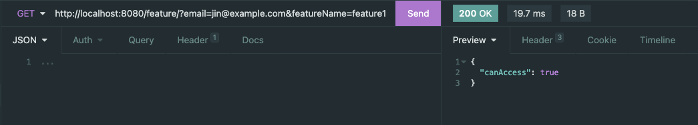
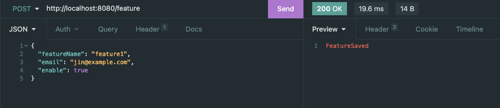

# Feature Switches

`GET /feature?email=XXX&featureName=XXX`

`POST /feature`

### Tech Used
Language: Java ☕️ \
Framework: Spring Boot 🌱 

### Notes
Used simple spring CRUD to perform save and read action, hence the data will not persist after the application has been shut down.
